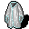
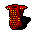

# GameC
Studies project called "Creating elements of a game". There was three task to do.

## Tasks and files
* Add new group of monsters
    * Scorpion.cs
    * ScorpionEmperor.cs
    * ScorpionGiant.cs
    * ScorpionEmperorFactory.cs
    * ScorpionFactory.cs
* Add new group of items
    * CrystalArmor.cs
    * GoldenDragonArmor.cs
    * Thanos'sGlow.cs
    * RefinedArmorFactory.cs
* Add new group of skills
    * BerserkerRage.cs
    * BerserkerRageDecorator.cs
    * FrighteningPitting.cs
    * FrighteningPittingDecorator.cs
    * TwistPierce.cs
    * TwistPierceDecorator.cs
    * RefinedMovementsFactory.cs

## Descriptions
### New group of monsters
I've created three monsters Scorpion (the most basic one), Scorpion Giant which one acts as a guard for Scorpion Emperor. When You beat a guard then emperor will show up. The difficulty of them goes Scorpion < Scorpion Guard < Scorpion Emperor. Their statistics are:
* Scorpion

    * Health: 20 + 10 * player level
    * Strength: 15 + 2 * player level
    * Armor: 50
    * Precision: 50 + 2 * player level
    * MagicPower: 0
    * Stamina: 5 + 10 * player level
    * XPValue: 50 + player level
    * BattleGreetings: "Ghhhzzz!"
    * Attack damage:
        * type: incisied
        * hp: 10
        * strength: (5 * Strength + XP) / 10
        * armor: ((2 * Strength + 5 * Precision + XP * 5) * Stamina / 50) / 10
		* precision: Precision * XP / 10000 
        * magic: 0

* Scorpion Giant

    * Health: 30 + 10 * player level
    * Strength: 15 + 2 * player level
    * Armor: 80
    * Precision: 70 + 2 * player level
    * MagicPower: 0
    * Stamina: 5 + 10 * player level
    * XPValue: 60 + player level
    * BattleGreetings: "You will die before crossing this doorstep!"
    * Attack damage:
        * type: incisied
        * hp: 10
        * strength: (5 * Strength + XP) / 10
        * armor: ((2 * Strength + 5 * Precision + XP * 5) * Stamina / 50) / 10
		* precision: Precision * XP / 10000 
        * magic: 0

* Scorpion Emperor

    * Health: 40 + 10 * player level
	* Strength: 15 + 2 * player level
	* Armor: 60
	* Precision: 100 + 2 * player level
	* MagicPower: 0
	* Stamina: 5 + 10 * player level
	* XP: 100 + player level
	* BattleGreetings: "How it is possible that You killed my guard!"
    * Attack damage:
        * type: incisied
        * hp: 10
        * strength: (5 * Strength + XP) / 10
        * armor: ((2 * Strength + 5 * Precision + XP * 5) * Stamina / 50) / 10
		* precision: Precision * XP / 10000 
        * magic: 0
* Every monster have its own facbric class.

### New group of items
I've created three items: 
* Crystal Armor - the most complicated one. Gives player 5% to player's biggest statistic everytime player receive a hit from monster which main statistic will be different
* Golden Dragon Armor - as much hp damage player receive as much damage spread for every statistic player will cause in next turn
* Thanos's Glow - doubles strength and reduces stamina to 70%
* All the foregoings items have one fabric class.

### New group of skills
I've created three skills:
* Berserker Rage - a chance equal to half of player's strength stat to land 0.5*Str Hp, 0.25*Str Precision damage. Type of damage is called "incised" and skill requires Axe.
* Frightening Pitting - a chance to land multiplayed by 0 to 10 sum of precision and strength divided by 50 for HP and 20 for armor. Type of damage is called "cut" and skill requires Spear.
* Twist Pierce - a chance 100/225 of precision stat to land (0.25*Str + extra 20 points if player have more strength than 100) HP and 0.25*PR Armor damage. Type of damage is called "incised" and skill requires Sword.
* For all skills I've make different decorators - it makes possibility to create combo of skills of the same type. The foregoing represents one of possible types in whole game. 
* All of the foregoings and theirs decorators have one fabric class.
